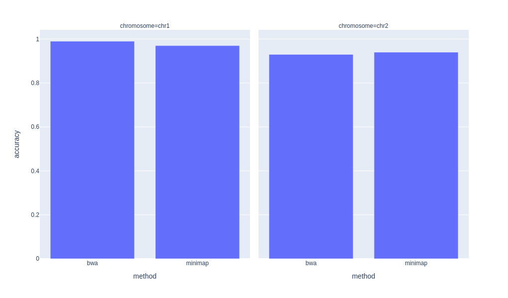

# Hierarchical Results

This is a simple prototypic implementation of a logger that lets you store results on disk in a hierarchical structure (with directories) and retrieve those results into a Pandas dataframe.

## Example
The package is based on the assumption that you have a given set of `results` for a given set of `parameters` (i.e. that a combination of the paramaters can generate one or more results).

```python
from hierarchical_results import HierarchicalResults, ParameterCombinations

parameters = ["method", "genome", "chromosome"]
results = ["accuracy", "runtime"]

hr = HierarchicalResults(parameters, results)
hr.store_result(["bwa", "hg38", "chr1"], "accuracy", 0.99)
hr.store_result(["bwa", "hg38", "chr1"], "runtime", 100)
hr.store_result(["bwa", "hg38", "chr2"], "accuracy", 0.93)
hr.store_result(["bwa", "hg38", "chr2"], "runtime", 102)
hr.store_result(["minimap", "hg38", "chr1"], "accuracy", 0.97)
hr.store_result(["minimap", "hg38", "chr1"], "runtime", 15)
hr.store_result(["minimap", "hg38", "chr2"], "accuracy", 0.94)
hr.store_result(["minimap", "hg38", "chr2"], "runtime", 16)

# We want to get all results for a given combinations of parameters
# We use the ParameterCombinations class to represent combinations of parameters
combinations = ParameterCombinations(hr.get_names(), [["bwa", "minimap"], "hg38", ["chr1", "chr2"]])
dataframe = hr.get_results_dataframe(combinations, ["accuracy", "runtime"])
print(dataframe)
```

The above gives a dataframe with the results for the given combinations. You will also have file on disk (e.g. `bwa/hg38/chr1/accuracy.txt` etc. with the results).

```
    method genome chromosome  accuracy  runtime
0      bwa   hg38       chr1      0.99    100.0
1      bwa   hg38       chr2      0.93    102.0
2  minimap   hg38       chr1      0.97     15.0
3  minimap   hg38       chr2      0.94     16.0
```

With plotly, we can easily plot this dataframe:
```python
import plotly.express as px
px.bar(dataframe, x="method", y="accuracy", facet_col="chromosome")
```

.. which generates this plot:


